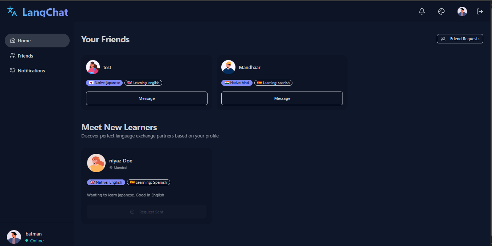
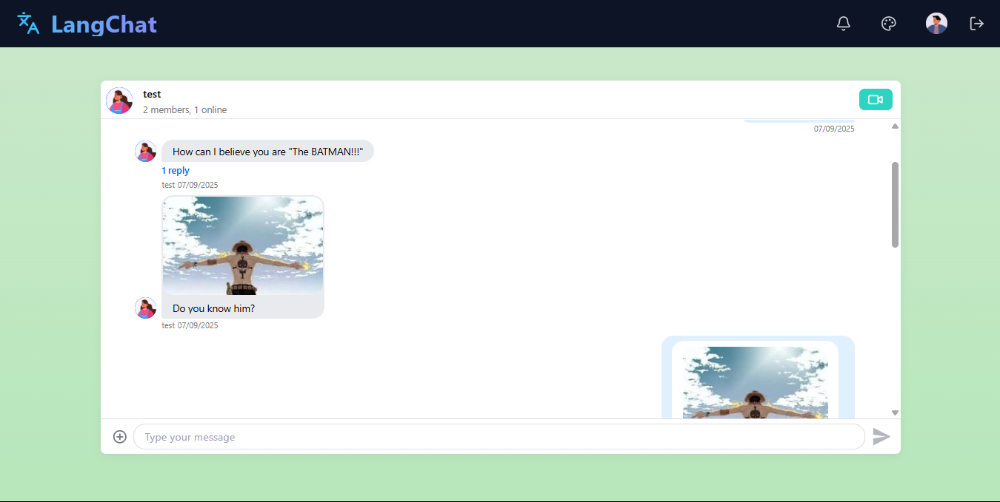
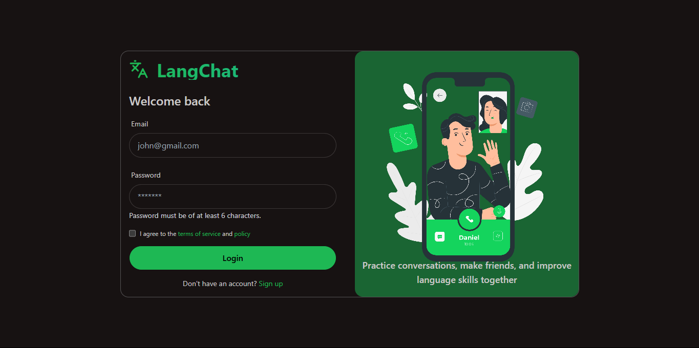
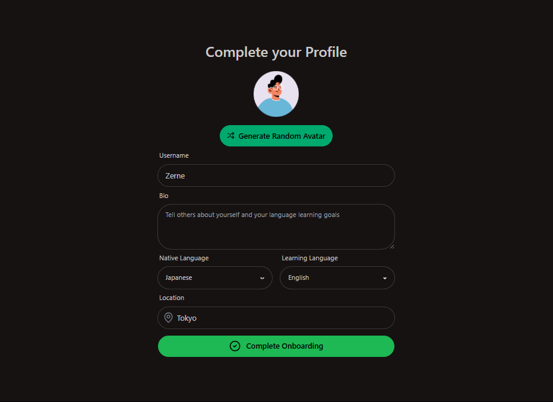
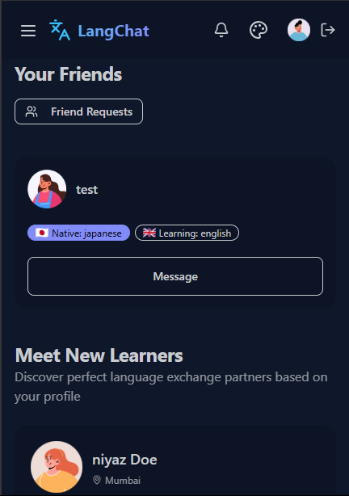

# LangChat - Real-Time Language Exchange Chat Application

LangChat is a comprehensive platform designed for language learners to connect, practice, and improve their skills through real-time conversations. The application facilitates finding language exchange partners based on your native and target languages.

<p align="center">
  
</p>

**🚀 Live Demo: [LangChat App](https://langchat-zhwz.onrender.com/)**

## Features

- 🔐 **User Authentication** - Secure signup, login, and session management
- 👤 **User Profiles** - Customizable profiles with native and learning language preferences
- 👥 **Friend System** - Send and accept friend requests from other language learners
- 💬 **Real-Time Chat** - Instant messaging with language exchange partners
- 📹 **Video Calls** - Practice speaking skills through integrated video conversations
- 🎨 **Multiple Themes** - 30+ customizable UI themes for personalized experience
- 🔍 **Partner Matching** - Find suitable language exchange partners based on your profile
- 📱 **Responsive Design** - Works seamlessly on desktop and mobile devices

<p align="center">
  
</p>

## Tech Stack

### Frontend

- React with Vite
- React Query (data fetching)
- React Router v7
- TailwindCSS + DaisyUI (styling)
- Stream Chat SDK (messaging)
- Stream Video SDK (video calls)

### Backend

- Express.js
- MongoDB & Mongoose
- JWT Authentication
- Stream API Integration
- RESTful API design

<p align="center">
  
</p>

## Installation and Setup

### Prerequisites

- Node.js (v16+)
- MongoDB instance
- Stream account for API keys

### Environment Variables

**Backend (.env)**

```env
PORT=5000
MONGO_URI=your_mongodb_connection_string
JWT_SECRET=your_jwt_secret
STREAM_API_KEY=your_stream_api_key
STREAM_API_SECRET=your_stream_api_secret
```

**Frontend (.env)**

```env
VITE_STREAM_API_KEY=your_stream_api_key
```

### Installation

```bash
# Clone the repository
git clone https://github.com/Niyaz-0/langchat.git

cd langchat

# Install root dependencies
npm install

# Install backend dependencies
cd backend
npm install

# Install frontend dependencies
cd ../frontend
npm install
```

### Start the development servers

```bash
# Start backend server (from backend directory)
npm run dev

# Start frontend server (from frontend directory)
npm run dev
```

<p align="center">
  
</p>

## Usage

1. Create an account or login
2. Complete the onboarding process by setting your:
   - Username
   - Profile picture (or generate a random avatar)
   - Bio
   - Native language
   - Learning language
   - Location
3. Browse recommended language partners
4. Send friend requests to potential language partners
5. Accept incoming friend requests
6. Start conversations with your friends
7. Initiate video calls for speaking practice

<p align="center">
  
</p>

## Project Structure

```
├── backend/                # Express backend
│   ├── controllers/        # Route controllers
│   ├── lib/                # Utility functions
│   ├── middlewares/        # Express middlewares
│   ├── models/             # Mongoose models
│   └── routes/             # API routes
│
└── frontend/              # React frontend
    ├── public/            # Static assets
    └── src/
        ├── components/    # Reusable components
        ├── constants/     # Application constants
        ├── hooks/         # Custom React hooks
        ├── lib/           # Utility functions
        ├── pages/         # Page components
        └── store/         # Redux store setup
```

## API Endpoints

### Authentication

- `POST /api/auth/signup` - Register a new user
- `POST /api/auth/login` - Login existing user
- `POST /api/auth/logout` - Logout user
- `POST /api/auth/onboard` - Complete user onboarding
- `GET /api/auth/me` - Get current user info

### Users

- `GET /api/users` - Get recommended users
- `GET /api/users/friends` - Get user's friends
- `POST /api/users/friend-request/:recipientId` - Send friend request
- `PUT /api/users/friend-request/:requestId` - Accept friend request
- `GET /api/users/friend-requests` - Get incoming and accepted friend requests

### Chat

- `GET /api/chats/token` - Get Stream Chat token

## Frontend Routes

- `/` - Home page with friends list and recommended users
- `/login` - User login
- `/signup` - User registration
- `/onboarding` - Profile setup
- `/chat/:id` - Chat conversation with a specific user
- `/notifications` - Friend requests and notifications
- `/friends` - Friends list
- `/call/:id` - Video call interface

<p align="center">
  
</p>

## Build and Deployment

To build the application for production:

```bash
# From root directory
npm run build
```

This will:

- Install all dependencies
- Build the React frontend
- Prepare for production deployment

To start the production server:

```bash
# From root directory
npm start
```

## Made By Niyaz for language learners

